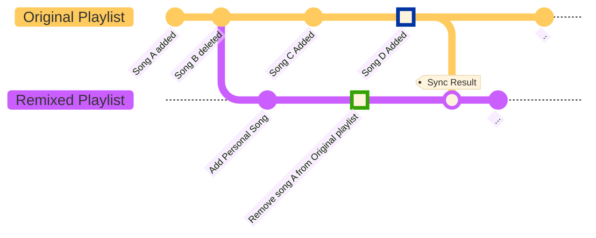

# 🎧 Remixing a Playlist

Ever listened to someone else's playlist where you like most songs, but hate some? 🎧 Well, now's your chance to take control!  
Our app lets you "remix" playlists, so you can add or remove songs to your heart's content, and synchronize with the original at any time you want! 🎶  
  
  
Here's how it works:
  
1. First, you need to find a playlist you want to remix. Follow the playlist in Spotify, and it will show up in our app.
2. Make sure you're logged in. 
3. We start by making a copy of the original playlist. This copy, which we call the 'remixed' playlist, is your canvas. Feel free to add or remove songs to your heart's content! 🎨
4. While you're busy with your remixed playlist, the original playlist can still be updated by its creator. But fear not! You won't miss out on any new bops 🎵, because our app lets you sync your remixed playlist with the original one at any time.
5. When you choose to sync, our app will compare the latest versions of both playlists. Songs that are in both playlists are automatically included in the newly synced remixed playlist.
6. For songs that have been added or removed in the remixed playlist compared to the original, we'll show you a comparison screen. Here, you can review the differences and decide which changes you want to keep in your remixed playlist.

And voila! You're a DJ! 🎉

This diagram shows the history of a remixed playlist. As you can see, it's a journey of creativity and discovery! 🌈
