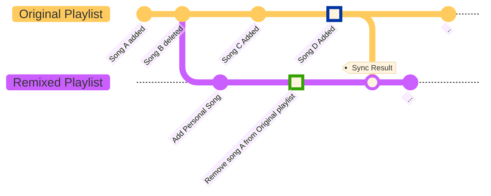

# 🎧 Remixing a Playlist

Ever listened to someone else's playlist where you like most songs, but hate some? **Well, now's your chance to take control!**  
 
Our app lets you "remix" playlists, so you can add or remove songs to your heart's content, and synchronize with the original at any time you want! 🎶   
Here's how it works:
  
1. First, you need to find a playlist you want to remix. Follow the playlist in Spotify, and it will show up in our app.
2. Make sure you're logged in (top right corner). 
3. Navigate to the [playlist overview](/apps/remix) to find playlists to you want to take control over. We start by making a copy of this original playlist. This copy, which we call the 'remixed' playlist, is fully yours. Feel free to add or remove songs to your heart's content!
4. While you're busy jamming to your remixed playlist, the original playlist can still be updated by its creator. 
    But fear not! You won't miss out on any new vibes, because Spotify Manager lets you sync your remixed playlist with the original one at any time.
5. When you choose to [sync a remix from the overview](/apps/remix-overview), our app will compare the latest versions of both playlists. Songs that are added by the original creator or by you, are automatically put in the draft synced playlist. Songs that are removed by the original creator or by you are kept separately at first, but you can always choose to add your favorite (removed) song back to the draft synced playlist. 🔄 

 
  
And voila! You're a DJ! 🎉
  
 
  
A typical remix journey might look like this:  

