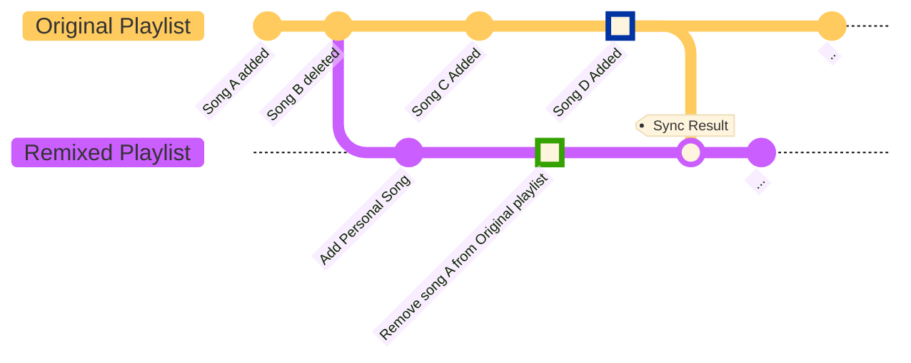

# Heading 1 Test
Testing regular test


```javascript
console.log("Hello World")
```



```mermaid
%%{
    init: {
        'theme': 'base',
        'gitGraph': {
            'showBranches': true,
            'showCommitLabel':true,
            'mainBranchName': 'Original Playlist'
        }
    }
}%%
gitGraph
    commit id: "Song A added"
    commit id: "Song B deleted"

    branch "Remixed Playlist"
    commit id: "Add Personal Song"

    checkout "Original Playlist"
    commit id: "Song C Added"

    checkout "Remixed Playlist"
    commit id: "Remove song A from Original playlist" type: HIGHLIGHT


    checkout "Original Playlist"
    commit id: "Song D Added" type: HIGHLIGHT

    checkout "Remixed Playlist"
    merge "Original Playlist" tag:"Sync Result"

    commit id: "..."

    checkout "Original Playlist"
    commit id: ".."
```
